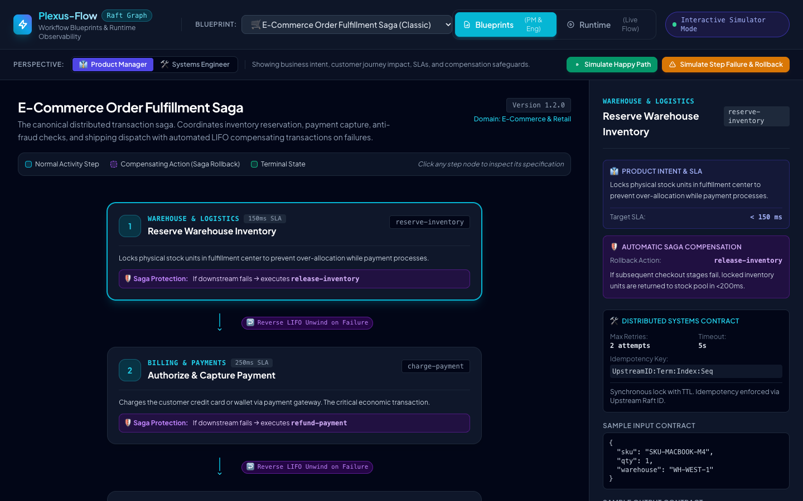
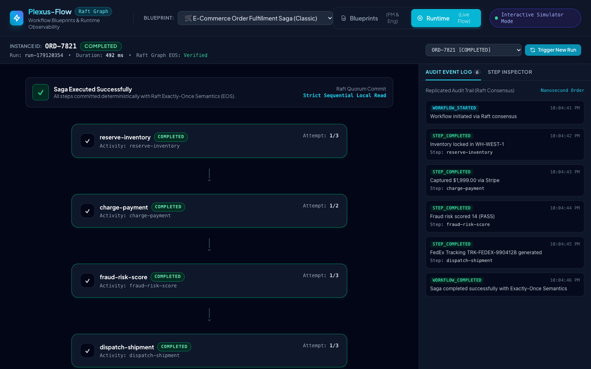
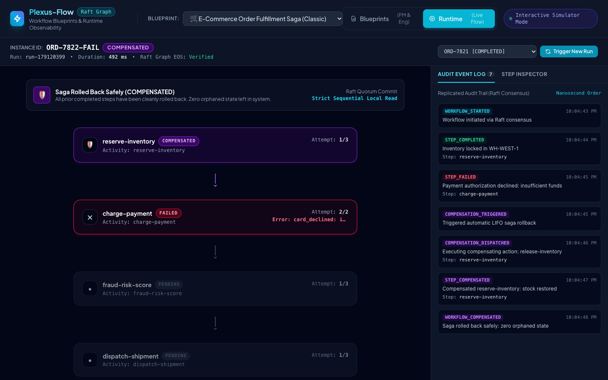

# Plexus-Flow Visualization Showcase

Interactive visualization of workflow **Blueprints** and **Runtime Observability**, designed for both **Product Managers** and **Systems Engineers**.

Showcases the canonical distributed transaction problem: **The E-Commerce Order Fulfillment Saga** (with reverse-order LIFO compensation) and the **Consumer Loan Underwriting Pipeline** (fork-join parallel execution with human-in-the-loop review).

---

## Quickstart

Run the showcase server:

```bash
go run ./examples/flowviz
```

Or build and run the binary:

```bash
go build -o bin/flowviz ./examples/flowviz
./bin/flowviz --http 127.0.0.1:8080
```

Then open your browser at:
👉 **[http://127.0.0.1:8080](http://127.0.0.1:8080)**

---

## Visual Previews

### 1. Blueprints View (How the Product is Defined)


### 2. Runtime Observability (Live Successful Saga Execution)


### 3. Saga Rollback Observability (Simulated Failure & LIFO Compensation)


---

## Key Highlights

### 1. Blueprints View (Product Managers & Engineers)
- **Product Manager Perspective**:
  - Highlights business objectives, customer journey milestones, and SLAs.
  - Explains step intent in plain language ("Why does this step exist?").
  - Visually traces the **Automatic Saga Rollback Route** (reverse-order LIFO compensation) if any step fails.
- **Systems Engineer Perspective**:
  - Highlights distributed systems contracts: activity handler names, timeouts, retry attempts with backoff.
  - Demonstrates deterministic idempotency keys (`UpstreamID:Term:Index:Seq`) verified by the embedded `dedup.Store` for Exactly-Once Semantics (EOS).
  - Displays input and output JSON schema contracts.

### 2. Runtime View (Live Observability & Audit Trail)
- **Dynamic DAG State Machine**:
  - Real-time step status badges: `PENDING`, `RUNNING` (pulsing glow), `COMPLETED` (green checkmark), `FAILED` (red alert), `COMPENSATING` (purple reverse pulse), `COMPENSATED` (shield badge).
  - Step metrics: execution duration, retry attempts, actual input and output payloads.
- **Replicated Raft Audit Trail**:
  - Replicated event history timeline with nanosecond timestamping proving strict consensus ordering across Raft quorum.
- **Interactive Scenarios**:
  - **Happy Path**: Full order completion with all steps passing.
  - **Payment Decline (Automatic Saga Rollback)**: Payment fails due to insufficient funds; triggers automatic reverse-order compensation releasing held warehouse inventory.
  - **Carrier Outage (Multi-Step Rollback)**: Shipping API fails; automatically cascades backward, refunding payment and releasing inventory.
  - **Human Gate (Loan Officer Approval)**: Pauses execution awaiting an approval or rejection signal via workflow API.
